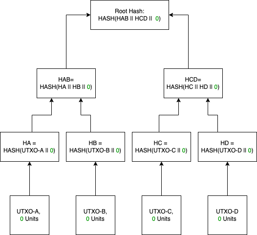

# The Fool's Upright Dive into Taro Protocol

{height=256px}

*... is the number 0 of the Major Arcana, which stands for the number of unlimited potentials. To see the Fool tarot card generally indicates that you are on the verge of an unexpected and exciting new adventure. This may require you to take a blind leap of faith.*

It has been a few weeks since Roasbeef had published the original Taro specifications, and I'm getting questions from friends and colleagues, knowing that I am doing work in adjacent areas. I made this write-up in response to these questions. It is an attempt at a simplified explanation that will hopefully help digest complex details given in the original bip-taro. I was using this: https://www.mail-archive.com/bitcoin-dev@lists.linuxfoundation.org/msg11221.html and the links inside as a source of knowledge on the subject.

\clearpage

## Merkle Tree Recap

Taro's specification says that it can track any number of custom digital assets without bloating the underlying chain (Bitcoin). One way to think about it – Taro aims to improve a use case of USDT on the Bitcoin Omni layer by using the Merkle Tree approach, which is super space-efficient in Bitcoin, instead of the `OP_RETURN` field, which is block space-hungry.

Generally, Merkle trees allow *committing* a near-infinite amount of data into a single Merkle root, while creating a single Bitcoin taproot transaction indistinguishable from any other P2TR output, without adding too much[^1] data to the on-chain record itself.  *Committing* means, in this context, to anchor to the state of the data.  If the data is presented along with the Merkle tree path, one can prove that it maps to a particular Merkle root, recorded as a transaction in the Bitcoin blockchain.  

Taro optimizes the anchoring of digital assets in Merkle roots by structuring the anchored data and Merkle paths.  Optimizations improve storage efficiency and validation speed – generally, by assuming that you are dealing with structured data, you can save time and space.  Enforcing a canonic form also allows making APIs for CRUD operations on anchors and anchored data.  The goal is to include this API suite into the Lighting Lab's `lnd`.  This way anyone who has access to a Lightning node will be able to create and track their digital assets, using the security provided by Bitcoin miners. 

Keep in mind that the data itself and the Merkle tree path must be stored elsewhere, unlike Omnilayer which uses the `OP_RETURN` field for storing the data.  Another thing to keep in mind is that Taro will anchor and secure any asset data you tell it to anchor, but it will not enforce your rules, like the "no double spend" rule, for example. But that is similar to the Omnilayer, so it should not surprise.

\clearpage

## The Invention: MS-SMT

The main building block for Taro is Merkle-Sum Sparse Merkle Tree (MS-SMT). Compared to the traditional Merkle tree, MS-SMT is different in several ways:

1. Generic Merkle trees can contain commitments to any data. Data that can commit to MS-SMT must adhere to a canonic structure designed specifically for tracking digital assets (coins, NFTs, and alike).  Each lowest-level *leaf* record is an ordered hash of a key-value pair, which could be considered a UTxO of an asset.  The key, in this context, is whatever data one needs to ID the UTxO (Asset_ID, Previous_UTXO_ID, PubKey, etc.)  Value is the amount of the asset contained in the UTxO.  Additionally, each branch of the MS-SMT has a new attribute - a sum of all amounts from the sub-branches, or the leaves it aggregates, as shown in +@fig:propagation, in green.

   {#fig:propagation height=300px}

\clearpage

2. MS-SMT's structured records must be ordered (like alphabetically, for example, or chronologically). Using a generic Merkle tree, one can prove the presence of the data.  The unique thing about MS-SMT is that one can also prove the absence of the data.  One can show the Merkle path to the leaf where the data is expected to be found according to the structure and offer either an empty (`null`) cell or a cell with zero amount. Whether zero or `null` will be shown depends on the asset type.  For NFTs, for example, the amount does not make sense since they are unique, so in that case there are `nulls`.  For `nulls` to be found without having to go through the whole list each time, MS-SMT has two special rules: 

   1. If a particular datum is possible but missing, there must be an empty cell present for that piece of data. 

   2. There should be no duplicate addresses (this is an automatic consequence of all the above, but for clarity, it is better to think about it as being a separate rule).

   *For example, if a structure like that would be tracking three-letter words, it will have 26^3^ addresses, for $AAA$, $AAB$, $AAC$, et cetera, up to $ZZZ$.  Each of these letter combinations is addressable by providing a Merkle path to it.  Now, to prove that the word $EYE$ is not present in the data set, one would give a Merkle path to the cell where it is expected to be, along with a mathematical proof that having this cell empty is the only way for the Merkle root to be what it is.* 

   Like in the example above, where the three-letter tree must have 26^3^ leaves (26 letters of the alphabet, three positions), the real-life MS-SMT tracks the entire key-space of all possible sha-256 hashes, i.e., it tracks all possible combinations of 256 zeroes and ones. It is a tree with 2^256^ leaves (2 "letters," 256 positions). It is 256-levels deep, which means that when calculating hashes, one has to merge with another branch 255 times to arrive at the Merkle root level, or one needs to have 255 proofs to validate a leaf. 

\clearpage

## Tracking an Asset

Let's review a basic example, where instead of 256 bits, we will have a key-space of only 2 bits.  

Suppose Alice wants to issue AliceCoin with the following rules :

- There must be only two addresses for AliceCoin. This is represented by bit 1: Alices (address 0) and Bobs (address 1).  For clarity, we will refer to them as `00` for Alice and `01` for Bob in the drawings.
- AliceCoin has a fixed supply of one indivisible coin, so bit 2 shows that an address either does not have a coin (0) or it has it (1). 

First, Alice creates an empty MS-SMT as shown in +@fig:empty. 

{#fig:empty height=150px}

Depending on the particular implementation, `root 00` may be recorded on Layer 1. Now Alice issues her one coin, which changes the system's state as shown in +@fig:genesis.

{#fig:genesis height=150px}

Merkle root of the Genesis Tree (`root 10`) is recorded on Layer 1. 

\clearpage

When Alice transfers her one coin to Bob, the asset tree changes as shown in +@fig:trx.

{#fig:trx height=150px}

The Merkle root of the new state of the system (`root 01`) is recorded on Layer 1.

{#fig:err height=150px}

The structure that we created can record a system state where both Alice and Bob have one coin each, which is shown in +@fig:err.  That is against the rules of AliceCoin, but the record structure supports it.  Errors like that must be caught outside of our MS-SMT.  For example, it can be done via *client-side validation*; in our case, that will mean that when Alice sends AliceCoin to Bob, she is supposed to change the system state from the one shown in +@fig:genesis to the one shown in +@fig:trx.  For Bob to accept AliceCoin, Alice has to give Bob all the necessary means to check the validity of both Merkle trees.  Bob takes the data supplied by Alice and calculates the Merkle root from it: the answer must be `root 01`.  If what he computed is different, he does not accept the transaction.

\clearpage

## From Nonexistence to a Universe

To prove nonexistence, one needs to verify the order of elements in an MS-SMT, along with the two rules mentioned above (no duplicates and covering the whole space of possibilities). In a tree with 2^256^ leaves, it's a lot of validations. To make it possible with a reasonable effort, MS-SMT is optimized further. To build MS-SMT, one needs to: 

1. Generate a baseline: an empty MS-SMT full of `null`s or full of zeroes.

   {#fig:baseline height=300px}

\clearpage

2. Make a rule that there must be no more than one non-zero leaf per MS-SMT. According to this rule, the tree's leaves shown in +@fig:propagation will require four separate trees, as displayed in +@fig:4-separate. For each of these trees, ordering and completeness can be validated by comparing them to the baseline tree shown in +@fig:baseline. For example, for `root hash 2`, `HCD` and `HA` should not differ from the baseline.

   {#fig:4-separate}

\clearpage

3. For an MS-SMT with *more than one record* (like in our case, and this is almost always the case), multiple one-leaf MS-SMTs are generated, and their roots become leaves of a higher-order tree, as shown in +@fig:universe.  

   {#fig:universe}

In our context, *more than one record* can mean a collection of different UTxOs of a single time slice of a Taro-tracked asset.  Also, *more than one record* can mean various database states over time.  Imagine a higher-level tree that combines time-related records and UTxOs. And add a map to it - the map will tell you where to find what in such a tree.  The map could be a flat file, a napkin drawing, or something else.  Now you can imagine why they call such a tree, overarching space and time, a "Universe."

There is another essential function that the Universe is playing in the system.  Remember that Merkle trees, being MS-SMTs or not, are very secretive.  Unless you have a Universe map: and know *where* (in which Bitcoin output) and *how* (what is the Merkle path) to look for an anchor of a transaction, you will not find it. 

To show how important this is, let's expand our earlier example of AliceCoin and add Caroll to the pool of addresses along with Alice and Bob.  There can be a situation that we will not be able to deal with unless we have a map.  Alice can cheat by sending the one and only coin twice (creating a double spend).  She can put two transactions – one to Bob, one to Caroll – into two separate Bitcoin outputs, and there is no way to find out.  Taro resolves this in the Universe.  Among other things, AliceCoin Universe is the one place where everyone should refer to make sure their transaction is registered and does not break the Universe's rules.  Along with address and amount, as we had in our earlier example, each leaf has a record of an ID of preceding UTxO.  Additionally, UTxO contains the recipe that will tell both Bob and Caroll how to interact with the AliceCoin Universe and what needs to be done to ensure their transaction is unique. 

## What It Is and What It Is Not

Taro is a very compact way to anchor data in the Bitcoin chain, inheriting Bitcoin's security without putting extra stress on the Layer 1 blockchain.  Lightning Labs will include Taro APIs in *lnd*. 

An important thing to keep in mind: Taro will not be storing your data and maps for you.  Also, it will not validate your rules – for example, you must figure out who must be responsible for not allowing a double-spend like the one shown in +@fig:err. 

The most obvious candidates to bear this responsibility are transaction participants - that is *client-side validation*.  Alternatively, such verification is provided by a trusted third party.

[^1]: You will not add data at all if you combine your data with some other legit transaction. But usually one would create a dedicated taproot transaction for that.
